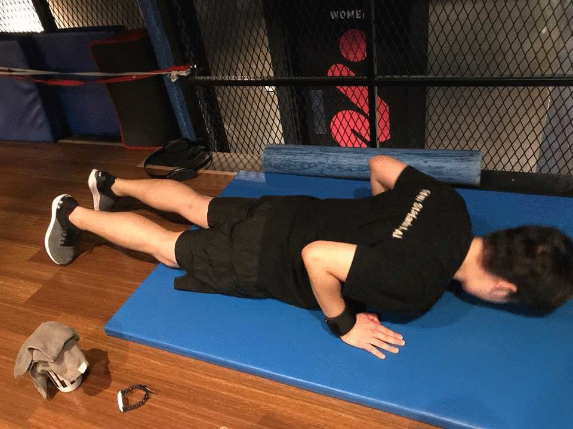

# TIE
Today I Exercise.

오늘 내가 한 운동을 기록하고 회고합니다.

|  | 18.09.06 | 18.12.04 | 18.12.18 | 18.12.28 | 19.01.02 | 19.01.23 | 19.01.31 | 19.02.07 |
|:--------|:--------:|--------:|:--------:|--------:|:--------:|--------:|:--------:|--------:|
| 체중 | 89kg | 83.6kg | 82.5kg | 81.3kg | 80.9kg | 79.4kg | 77.4kg | 77.8kg |
| 골격근량 | ? | 32.5kg | 32kg | 31.8kg | 32.2kg | 32.2kg | 31.8kg | 32.1kg | 
| 체지방량 | ? | 25.7kg | 25.3kg | 24.6kg | 23.4kg | 21.9kg | 20.5kg | 20.7kg |
| 체지방률 | 34% | 30.8% | 30.7% | 30.2% | 28.9% | 27.5% | 26.5% | 26.6% |

|  | 19.02.21 | 29.03.16 | 19.03.19 |  | |  |  |  |
|:--------|:--------:|--------:|:--------:|--------:|:--------:|--------:|:--------:|--------:|
| 체중 | 76.8kg | 74.5kg | 74.4kg | kg | kg | kg | kg | kg |
| 골격근량 | 32.4kg | 31.8kg | 32.3kg | kg | kg | kg | kg | kg | 
| 체지방량 | 18.7kg | 17.5kg | 16.4kg | kg | kg | kg | kg | kg |
| 체지방률 | 25.1% | 23.6% | 22.1% | % | % | % | % | % |

